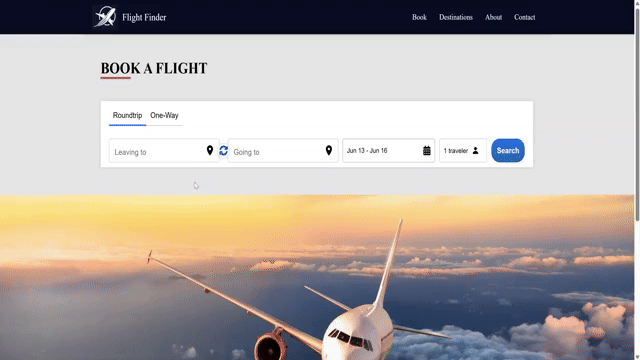

https://flightfinder2025.netlify.app/

# ✈️ Flight Search App

## 📌 Description
A complete flight search application built with React and Express that allows users to search for flights across U.S. airports using the Kiwi Flights API on RapidAPI. The frontend features real-time autocomplete using MUI’s `Autocomplete`, debounced input, dynamic filters for stops and airlines, and a modal to view flight amenities. The backend securely handles API requests using credentials stored in environment variables.

> **Note:** The project uses Kiwi RapidAPI exact-date endpoints: `api/v1/flights/search-oneway` and `api/v1/flights/search-roundtrip`. The backend keeps the existing frontend contract and maps Kiwi responses to the Amadeus-like shape used by the React app.

## 🚀 Features
- Round-trip and one-way flight search
- Airport autocomplete with indexed filtering
- Airline and stop filters
- Amenities modal per flight
- Responsive UI with loading states
- Backend with Express to protect API keys

## 🔧 Technologies Used
- Frontend: React, React Router, MUI, CSS Modules
- Backend: Node.js, Express
- API: Kiwi Flights via RapidAPI
- Tools: Debounce, custom hooks

## 🖼️ Demo





🔗 [Live Site](https://flightfinder2025.netlify.app/)  
🔗 [GitHub Repo](https://github.com/Yeinier22/airline)

## 📂 Installation
```bash
# Clone client and server separately
git clone https://github.com/Yeinier22/airline.git
cd client
npm install
cd ../server
npm install
```

## 🔐 Environment Variables
### Server (`server/.env.local`)
```
RAPIDAPI_KEY=your_rapidapi_key
RAPIDAPI_HOST=kiwi-com-flights-api.p.rapidapi.com
```

You can get these credentials from the Kiwi Flights API listing on RapidAPI.

### Client ()
client/.env:
```
PORT=4000
REACT_APP_BACKEND_URL=http://localhost:3000
```

### ⚙️ Configure root project
Install concurrently at the root:

Update your root package.json with:
"scripts": {
  "dev": "concurrently \"npm run dev --prefix client\" \"npm run dev --prefix server\""
}

### ▶️ Start the project
From the root directory:
```
npm run dev
```

## 📁 Folder Structure
```
project-root/
├── client/
│   ├── public/
│   ├── src/
│   │   ├── components/
│   │   ├── hooks/
│   │   ├── images/
│   │   ├── pages/
│   │   ├── utils/
│   │   └── App.js, config.js, etc.
│   └── package.json
├── server/
│   ├── src/
│   │   └── server.js, config.js
│   ├── .env.local
│   └── package.json
```

## 🧠 Learning & Challenges
- Handling secure API credentials with Express
- Creating a dynamic and debounced search experience
- Implementing index-based filtering logic for airports
- Managing filter state and UX in flight results
- Designing clean modal interactions for flight details

## 📜 License
MIT


